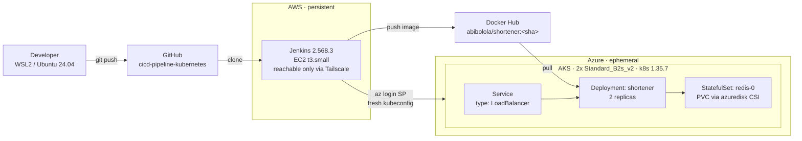

# CI/CD Pipeline to Kubernetes

A containerised Python API built, tested, scanned and deployed to a managed
Kubernetes cluster by a Jenkins declarative pipeline; reproducible from an
empty cloud account, and destroyed at the end of every session.

**Image:** [`abibolola/shortener`](https://hub.docker.com/r/abibolola/shortener) ·
**Pipeline:** 9 stages, ~2m42s end to end ·
**Infrastructure:** deployed and destroyed, measured cost **A$0.89**

---

## What it does

A URL shortener: `POST /shorten` returns a base62 code, `GET /{code}` issues a
307 redirect. Redis holds the counter and the code-to-URL mapping.

The application is deliberately small. The point of the project is the pipeline
and the Kubernetes design around it, not the business logic.

---

## Architecture



**Two lifecycles, deliberately separated.** Jenkins is persistent
infrastructure; stopped between sessions, not destroyed, so build history and
credentials survive. The cluster is disposable and recreated from a script each
session. This mirrors how a real CI controller and application environments are
managed, and it is the reason the pipeline authenticates with a service
principal rather than a stored kubeconfig.

---

## Tools

| Layer | Choice | Notes |
|---|---|---|
| Application | Python 3.12, FastAPI, Redis 7 | |
| Container | Docker, multi-stage build | Non-root UID 10001, no dev dependencies in the runtime image |
| Local cluster | kind, 3 nodes (k8s 1.37.0) | Manifests debugged here before any cloud spend |
| CI | Jenkins 2.568.3, declarative pipeline | EC2 t3.small, Ubuntu 24.04 |
| CI access | Tailscale (WireGuard mesh) | Security group has **no** inbound rules |
| Registry | Docker Hub, public | Tagged by commit SHA, never `latest` |
| Cloud cluster | AKS, 2× Standard_B2s_v2, `australiaeast` | Free control plane; node pool billed by the hour |
| Scanning | Trivy (HIGH/CRITICAL) | Runs before push |
| Provisioning | `az` CLI in `scripts/` | Terraform is deliberately deferred: see *Future improvements* |

---

## Pipeline

```
Checkout → Lint & Test → Build Image → Scan Image → Push Image → Deploy to AKS → Smoke Test
```

| Stage | What it does |
|---|---|
| Checkout | Resolves the short SHA; this becomes the image tag and the build display name |
| Lint & Test | `ruff` and `pytest` inside a `python:3.12-slim` container; JUnit XML published |
| Build Image | Multi-stage build, `APP_VERSION` passed as a build arg |
| Scan Image | Trivy, HIGH and CRITICAL, unfixed ignored |
| Push Image | Docker Hub, authenticated from the Jenkins credential store |
| Deploy to AKS | SP login, fresh kubeconfig, apply manifests, wait for LoadBalancer IP, patch `BASE_URL`, roll out |
| Smoke Test | Creates a short code against the public IP and asserts a 307 on redirect |

On failure, `post { failure }` runs `kubectl rollout undo`. On every build,
`post { always }` deletes the per-build kubeconfig and logs out of Azure.

---

## Key design decisions

**Images are tagged by commit SHA, never `latest`.** A Deployment only rolls
when its pod template changes, so a fixed tag means new code silently never
deploys while every command reports success. A changing tag also makes rollback
work, because the previous ReplicaSet still references a real, distinct image.

**Liveness and readiness probe different endpoints.** `/healthz` never touches
Redis; `/readyz` does. If liveness checked the datastore, a Redis blip would
crash-loop perfectly healthy API pods and turn a dependency outage into an
application outage. Readiness is the probe that *should* fail; it removes pods
from the Service endpoints and lets them back in on recovery, with no restarts.
Verified: see `07-readiness-redis-down.png`, restarts stay at 0 throughout.

**`maxUnavailable: 0` on the rolling update.** Kubernetes adds a healthy pod
before removing an old one, so capacity never drops during a deploy. This was
proven accidentally: see *Key learnings*.

**No cluster credential is stored.** The pipeline runs `az aks get-credentials`
into a per-build kubeconfig in the workspace, deleted in `post`. The service
principal is scoped to `rg-shortener` only, and the resource group persists
empty between sessions specifically so that role assignment survives cluster
teardown.

**The Redis password exists in exactly one durable place.** The Jenkins
credential store. It is never in Git, never in a manifest, and never in a build
log — the pipeline creates the Kubernetes Secret at deploy time via
`kubectl create ... --dry-run=client -o yaml | kubectl apply -f -`, which is
idempotent where plain `create` is not.

**Container hardening.** `runAsNonRoot` with an explicit UID (the kubelet cannot
verify a username without starting the container), `readOnlyRootFilesystem` with
an `emptyDir` mounted at `/tmp`, all Linux capabilities dropped, and
`allowPrivilegeEscalation: false` to set `no_new_privs`.

**Manifests are cloud-agnostic where it costs nothing.** The PVC omits
`storageClassName`, so it binds to `standard` (local-path) on kind and
`managed-csi` on AKS with no changes. The same YAML ran in both places.

---

## Reproduce

```bash
git clone https://github.com/abibolola/cicd-pipeline-kubernetes.git
cd cicd-pipeline-kubernetes
```

**Local, free:**

```bash
python3 -m venv .venv && source .venv/bin/activate
pip install -r requirements-dev.txt && pytest -q

docker compose up --build                 # app + redis on localhost:8000

kind create cluster --config kind-cluster.yaml
./scripts/deploy-local.sh
kubectl port-forward -n shortener svc/shortener 8000:80
```

**Cloud:**

```bash
az group create --name rg-shortener --location australiaeast
az ad sp create-for-rbac --name sp-jenkins-shortener --role Contributor \
  --scopes /subscriptions/<sub-id>/resourceGroups/rg-shortener

NODE_SIZE=Standard_B2s_v2 ./scripts/cluster-up.sh
# Jenkins: Build Now
./scripts/cluster-down.sh
```

Jenkins credentials required: `dockerhub`, `azure-sp`, `azure-tenant`,
`redis-password`.

---

## Evidence

Infrastructure was destroyed after the run, so the screenshots below in ```docs/evidence``` are the
record.

| File | Shows |
|---|---|
| `01-pipeline-green.png` | Full pipeline green, 9 stages, 2m42s |
| `02-pipeline-failed.png` | A broken test halting the build at Lint & Test: image never built, cluster never touched |
| `03-failed-test-console.png` | The assertion failure that caused it |
| `04-registry-tags.png` | Docker Hub tags: commit SHAs, no `latest` |
| `05-pods-running.png` | Pods across both nodes, LoadBalancer IP `20.227.13.177`, image `abibolola/shortener:6bfd4d0` |
| `06-endpoint-response.txt` | `curl` against the public endpoint: create and 307 redirect |
| `07-readiness-redis-down.png` | Redis scaled to zero — pods unready, **zero restarts** |
| `08-pvc-survives-pod-delete.png` | `redis-0` deleted, returns with the same name and its data |
| `09-pdb-blocks-drain.png` | PodDisruptionBudget refusing an eviction during `kubectl drain` |
| `10-resource-group-deleted.png` | Empty resource group after teardown |
| `11-stalled-rollout-guard.png` | A bad image contained by `maxUnavailable: 0` with no downtime |
| `12-jenkins-credentials.png` | Credential store in use, values masked |
| `13-cost-analysis.png` | Azure Cost Management: A$0.89, all in the AKS-managed resource group |

---

## Key learnings

**A bad deploy was contained by the rollout strategy, and I saw it happen.**
`05-app-deployment.yaml` was applied directly at one point, with
`IMAGE_PLACEHOLDER` unsubstituted. The Deployment created a second ReplicaSet,
`maxSurge: 1` allowed one new pod, and `maxUnavailable: 0` prevented it from
touching either healthy pod. The result was a permanently stalled rollout at
full capacity rather than an outage. It also does not self-resolve: it needs an
explicit `rollout undo` or a corrected apply.

**`InvalidImageName` and `ImagePullBackOff` are different failures.** The first
means the reference could not be parsed at all, so no pull was ever attempted.
The second means the pull was tried and failed. The distinction narrows
debugging immediately.

**ConfigMap values are snapshotted at container start.** Editing a ConfigMap
does not restart pods; the running containers keep the old environment
indefinitely. The production fix is a checksum annotation on the pod template,
so a config change alters the template hash and triggers a rollout
automatically. This is why the pipeline patches `BASE_URL` *before* applying
the Deployment, not after.

**A two-node cluster cannot be safely drained.** During the PDB test, the
application tier evicted cleanly — two replicas, `minAvailable: 1`, room to
move. But Azure's own `metrics-server` and `konnectivity-agent` run two
replicas with their own PDBs and anti-affinity, so with only two nodes their
replacements had nowhere to schedule and the drain retried indefinitely. That
is a concrete demonstration of why production clusters need at least three
nodes for rolling upgrades.

**I found a credential leak in my own manifest.** The Redis readiness probe
originally ran `redis-cli -a "$REDIS_PASSWORD" ping`. The variable is expanded
by the shell inside the container, so it never appears in the pod spec or in CI
logs — but it *does* appear in the container's process table, readable by
anyone who can `kubectl exec`. Fixed by using `REDISCLI_AUTH`, which `redis-cli`
reads from the environment instead of argv.

**`kubectl port-forward` binds to one pod, not the Service.** When readiness
failed during the Redis test, the tunnel died and it looked like the application
had crashed. It had not — restarts stayed at zero. Port-forward is a debugging
tool, not a load balancer, and mistaking one for the other during a real
incident would send you down the wrong path.

**Where a secret actually lives is a design decision, not an afterthought.**
Tracing the Redis password end to end: Jenkins credential store → pipeline env
var → `kubectl create secret` → pod environment; clarified that the Kubernetes
Secret is derived state, recreated every deploy, and that losing the cluster
loses nothing.

---

## Known limitations

- **Single-replica Redis with no PDB.** Draining its node evicts it with no
  failover; the service is unavailable until it reschedules. An Azure disk is
  also zonal, so the pod can only reschedule onto a node in the disk's zone.
- **Trivy does not block.** Currently `--exit-code 0`, so findings are reported
  but do not fail the build.
- **Bare `LoadBalancer` Service.** No Ingress, no TLS, no path-based routing.
- **Resource requests and limits are estimates,** not derived from measured load.
- **`az` CLI provisioning, not Terraform.** Reproducible, but imperative and not
  state-managed.

## Future improvements

Terraform for the cluster and the Jenkins host · NGINX Ingress with cert-manager
and TLS · Trivy as a blocking gate · metrics-server-driven resource tuning under
load · checksum annotation for automatic config rollouts · Redis config mounted
from a Secret file rather than passed as an argument · registry retention policy
· ArgoCD for pull-based GitOps deployment.

---

## Infrastructure lifecycle

The AKS cluster was created for this run and **destroyed immediately
afterwards**. The resource group is retained empty so the service principal role
assignment survives; it costs nothing. The Jenkins host is stopped rather than
terminated, preserving build history and credentials on its EBS volume for
roughly $2/month.

Everything required to rebuild both from scratch is in this repository.
Infrastructure is disposable; the code is the artifact.

### Measured cost

**A$0.89 (~US$0.58)** for the full deployment, per Azure Cost Management:

| Service | Cost |
|---|---|
| Virtual Machines (2× Standard_B2s_v2) | A$0.66 |
| Storage (node OS disks + Redis PVC) | A$0.18 |
| Virtual Network | A$0.04 |
| Bandwidth | <A$0.01 |
| Load Balancer | A$0.00 |

The AKS **control plane is free**, and the standard load balancer stayed inside
its free allowance (0.4 GB processed against 15 GB, 3.11 of 750 rule-hours), so
the entire bill was compute and disk for the roughly one hour the cluster
existed.

